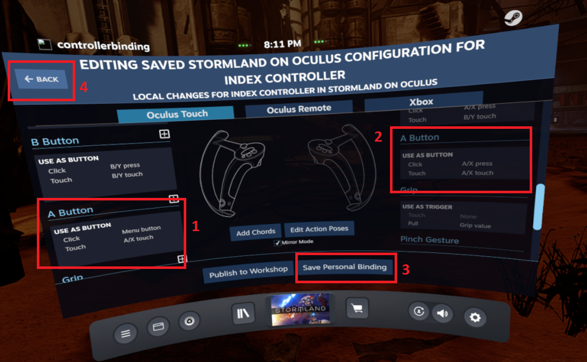

 
Are you an HTC Vive owner looking for new games? Tired of seeing the same old SteamVR titles month after month? Looking for quality entertainment but not sure where to find it? 

Well then you need [Oculus](https://www.oculus.com/experiences/rift/)! Many Oculus games can be [played](https://github.com/LibreVR/Revive/wiki/Compatibility-list) on Vive. [Stormland](https://www.oculus.com/stormland/?locale=en_US) for example is an epic adventure game created by [Insomniac Games](https://insomniac.games), the same folks who brought you [Ratchet and Clank](https://insomniac.games/game/ratchet-and-clank-ps4/)! 

Big names like this are needed in Virtual and Augmented Reality, now known as [XR](https://en.wikipedia.org/wiki/Extended_reality) so let’s take a look at running this Oculus title on a Vive.

#### Does Your Vive needs a Revive?
[Revive](https://github.com/LibreVR/Revive/releases) allows you to play Oculus games on your [HTC Vive](https://www.vive.com/ca/accessory/controller/) as well as other systems. You can use your existing [Vive Wands](https://www.vive.com/ca/accessory/controller/) or any other controllers compatible with [SteamVR](https://store.steampowered.com/app/250820/SteamVR/). The steps below show how to set up [Valve Index Controllers](https://www.valvesoftware.com/en/index/controllers) for use with Vive and the Oculus store. Revive also allows you to play Oculus games on your [HTC Vive Cosmos](https://www.vive.com/eu/product/vive-cosmos/features/), [Valve Index](https://www.valvesoftware.com/en/index/headset), [Windows Mixed Reality](https://www.microsoft.com/en-us/mixed-reality/windows-mixed-reality) systems and more.

Don’t forget to check the [compatibility list](https://github.com/LibreVR/Revive/wiki/Compatibility-list) _before_ making your purchase! Make sure your game works in Revive before you buy it. Currently Stormland is listed as "Working – Stormland fix". It works perfectly out-of-the-box requiring only the controller customizations below. Performance is fine but likely takes a head due to the added overhead of whatever Revive is doing.

As much fun as it is, Revive is not officially supported or endorsed by Oculus so they could block it at any time. This means you are taking the risk that all your Oculus games could disappear at any time or at least your ability to play them... But that is the reality of any jailbreaker, modder, experimenter, enthusiast, hobbiest, etc and what usually gets you closer to the good stuff. Besides, you didn’t buy put together your VR rig just to play phone games on. You want something with a little substance. So for those of us willing to take the risk there’s Revive. 

#### System:  
* [Intel 8700 I7](https://ark.intel.com/content/www/us/en/ark/products/126686/intel-core-i7-8700-processor-12m-cache-up-to-4-60-ghz.html)
* 32 GB RAM 
* [Nvidia Geforce 1080ti](https://www.nvidia.com/en-sg/geforce/products/10series/geforce-gtx-1080-ti/)
* [SteamVR](https://store.steampowered.com/app/250820/SteamVR/)
* [Valve Index Controllers](https://www.valvesoftware.com/en/index/controllers)
* HTC Vive Headset 
* [BaseStation ver 1.0](https://www.vive.com/eu/accessory/base-station/)
* 1TB Hard Disk Drive - 7200 RPM SATA

*Half-Life Alyx*

*Stormland on Revive on Oculus*

#### How to Install and Configure Revive for HTC Vive:
1.	Install [Oculus Rift S Software](https://www.oculus.com/setup/) but do not set up the headset.

2.	Follow the installation default options until you get to the screen instructing you to connect your headset. Do not complete this step.

3.	Click the Skip Setup button. 

For Vive setups you will not be setting up the controllers. 

The hardware setup step is left incomplete indefinitely. 

Proceed to the next step.

Install the latest version of the ReviveInstaller.exe from github (the one with the highest version number – v2.1.1 as of July 2020)

5.	Launch Oculus and purchase [Stormland](https://www.oculus.com/experiences/rift/1360938750683878/?ranking_trace=117254459210015_1360938750683878_SKYLINEWEB_15sLveFiOUbKwuHmu)

6.	Launch SteamVR and put on the headset.

7.	Open the SteamVR dashboard and note that there is now a new button called Revive. You can click this to bring up the Revive dashboard with all your games. For now just note it’s location. We still need to set up the controllers. You can launch your Oculus titles using the Revive button or from the regular SteamVR menu.

For future refernce, you can launch Stormland from the Revive Dashboard that appears after clicking the Revive button. (get pic - josh)You can also launch it from the Steam menu like any other game.

By default there is no way to press the in-game Pause Menu button with the Valve Index Controllers and the jump button doesn't work.

We will assign the left A button to the Pause Menu and the right A button to Jump.

Launch SteamVR and once it's running press the System button on the Knuckles to bring up the System Menu.

1. Select Settings
2. Click Controllers
3. Click Show Old Binding UI

On the screen entitled _Change Bindings For Stormland on Oculus_ select _Stormland on Oculus_. 

You can select a pre-programmed binding. A binding defines which actions are bound to which buttons.

We can use the Official Binding for Revive/Index as a template and then edit it to fix the A buttons.

### How to Change Controller Bindings Valve Index (Knuckles) Controllers for Stormland: 

A.	Identify the Official Bindings section.

B.	Locate "Stormland - Index Controllers - Grip Fix" and click on Activate. This will fix a surprisingly annoying bug where the Index controllers constantly pickup your guns every time either hand comes anywhere near your waist where the guns are holstered. If you don't fix this with the "Grip Fix" bindings you will have to play the game while T-Posing to avoid wielding your guns when you really don't want to.

C. Once the Binding is Activated it becomes your Current Binding. This means you can now edit the Bindings so the A buttons will work properly.
Click Edit on your new Current Binding. This way you can manually assign the left and right A buttons.

Once you’ve clicked Edit you’ll see all buttons their actions. We're only here for the Left and Right A buttons.

Each button can be edited by clicking the little pencil icon that appears when you point at the text in each box. 

After clicking the Edit (pencil icon) for the button you are re-assigning, you can assign the function you want.  

Remember to disable Mirror Mode in the middle of the screen to set different controls for right and left controllers. 

We will do this to make the Left A activate the Pause Menu and the Right A to be the Jump button. The Actions you can apply to the button can be seen in the picture below:

Edit the button assignments for both A buttons to select the accompanying function for each. 

Valve Index buttons are so full of sensors that they have different settings for Touching the button versus Clicking it. 

We only want to change the Click behavior although obviously you can set the touch to anything you’d like. I left mine as they were.

After you’ve set the buttons correctly the button assignments should look like this:

Ensure the A buttons have been set as follows:

Left A Button: Click = Menu button
Right A Button: Click = A/X press

Click Save Personal Binding to keep your edits.

Click the Back button in the top left corner until you are back in the game. 

Try the buttons, Left A should now open the Pause Menu and Right A should make you jump. Depending on where you are in the game, it may not be possible to jump but you will see an electric field flash around you instead. 

This is fine, the button is working properly and will make you Jump again when you have left the base.

Disable thumb-pad press binding - By default, the Index Thumb Pads are assigned to open the Pause Menu. 

This becomes frustrating in-game when you accidentally press the pads which are located so conveniently under each thumb. 

The popup menu totally interrupts whatever you were doing, so it’s a good idea to disable the thumb-pad menu option. 

This can be disabled in-game as follows:
(get this - josh)

There you have it. All set to enjoy some sweet Oculus goodness on your Vive. Do it for yourself. Do it for the children. Do it for the Zuck who can clearly see the future and wants you to be a part of it. Just look how happy it makes him when people use his stuff.

#### Potential Issues:
Oculus Games Won’t Install – as soon as I bought Stormland I started the download. The download completed but when I clicked the “Install” button nothing happened. This is what happens when your Oculus games are saved at C:\Program Files\Oculus\Software (or anywhere in the C:\Program Files\Oculus folder).
For some reason Oculus doesn’t like it’s games to be within it’s own Program Files folder. Easy enough to change, simply put the games anywhere else, create a new folder wherever you have space and use this new folder as default location for Oculus games. 
To set a new location for your saved games, follow the steps below:
1.	Launch the Oculus app from the Start menu, taskbar, or desktop.
2.	Click Settings.
3.	Click General.
4.	Click Edit in the Library Locations section.

5.	Click Add Location.

6.	Choose a new library location. You can use any folder you’d like, you can also create a new folder by right-clicking the background in the Select Folder window. Once created, you can select the new folder for the new location by double-clicking it and clicking Select Folder.

7.	Double-click your new or chosen folder and click Select Folder.
While you are in the settings, it is a good idea to set the new location as the default From the same menu as above (Settings/General)
1.	Identify the new location
2.	Click the elipses menu button
3.	Select Make Default

Now that your game file location is no longer C:\Program Files\Oculus\Software you will be able to install & play Oculus games. Woohoo! You made it! Give Stormland a try.
Also, in case of further issues there is a Revive wiki
If you’re really stuck or if you love Revive so much you simply must tell the developers and community, there’s a Revive Discord too.

Potential Issues:
Issue: Can’t restart your progress - Stormland doesn’t really provide an option for restarting your progress. It saves your game locally at whatever point you’ve reached and syncs this with your cloud save. You can’t just restart the game and choose a new save. This means multiple players have to share the same progress and isn’t ideal in cases where you have multiple people that want to start their own progress. As a workaround you have to delete or move your local saves, go offline, create new ones and then go back online to sync them with the cloud saves. This effectively over-writes your previous progress. 
Progress and preferences are kept in two files locally which are synchronized with your cloud saves. Two files track your progress and preferences. These files can be moved, copied or renamed to reset progress to start a new game.
In case you want to restart the game or have another person start their own progress, There really isn’t a proper way to restart Stormland in-game, so that a player can start from the beginning of the game. To get around this, the local save files below can be deleted, renamed or moved. Only complete these step is you want to lose your progress and settings in Stormland.
1.	Go offline with the computer Steam is installed on. Disable the Wifi or disconnect Ethernet – make sure you’re offline.
2.	Launch File Explorer and go to C:\Users\your_username\AppData\Local\Oculus\AppData\139725073420658\3257792424300278\cloud\data
3.	Delete, rename or move the two save files in this location:
o	stormland_gamedata_071220.save
o	stormland_userprefs.save 
Your files and folders may contain different numbers than the examples on this page. These files can be saved if you want to keep the progress stored in them. You can always copy them back into the data folder.
If you don’t see the appdata folder you can enable it with the steps below:
1.	Launch File Explorer
2.	In the File Explorer click View then Options and then Change Folder and Search Options

 

3.	In the next window that pops up select View and then down below in Advance Settings ensure “Show hidden files, folders and drives” is checked.

4.	Click OK
You will now see the the appdata folder in File Explorer. Go ahead and click through it until you are at the location below:
C:\Users\your_username\AppData\Local\Oculus\AppData\139725073420658\3257792424300278\cloud\data

1.	From there you can delete or rename the files contained in the folder. Your computer should still be offline at this point or it will simply retrieve your cloud saves and restore them to this location. To avoid this, launch Stormland while offline and begin the game. This means setting up dominant hand, etc and actually starting the level. This will create two new save and preference files. Once these have been created (you will see them again in C:\Users\your_username\AppData\Local\Oculus\AppData\139725073420658\3257792424300278\cloud\data) you can exit the game and go online again. When you next launch the game it will overwrite the cloud saves with the newly created files so your ‘progress restart’ will be replace the cloud saves. You are supposed to get a warning from Steam asking if you’d like to overwrite the cloud saves or the local saves but I did not get this alert. Instead SteamVR just loaded the new local save/pref files and used them to overwrite my cloud progress. This is what I wanted in t his case but be aware you can overwrite cloud saves easily and potentially lose your progress by following these steps.

Finally, you are all set! Fire up Stormland and experience the goodness of Oculus. It probably takes a performance hit due to Revive overhead but hopefully this isn't needed much longer. [OpenXR](https://www.khronos.org/openxr/) is here and Oculus and Facebook are both members. Other members include Amazon, Apple, Google, Intel, Nvidia, Qualcomm, Samsung, Sony, Valve, Nintendo, Nokia, Panasonic, EA, Epic Games, AMD, Huawei, Acer, Alibaba, Broadcom, Hitachi, HP, HTC, Red Hat, Unity, VMWare and [many](https://www.khronos.org/members/list) more!

Thanks,

Josh

