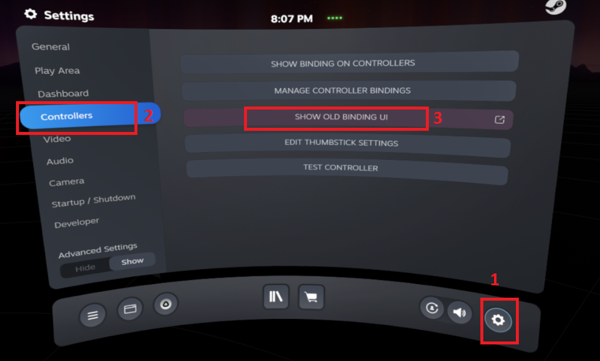
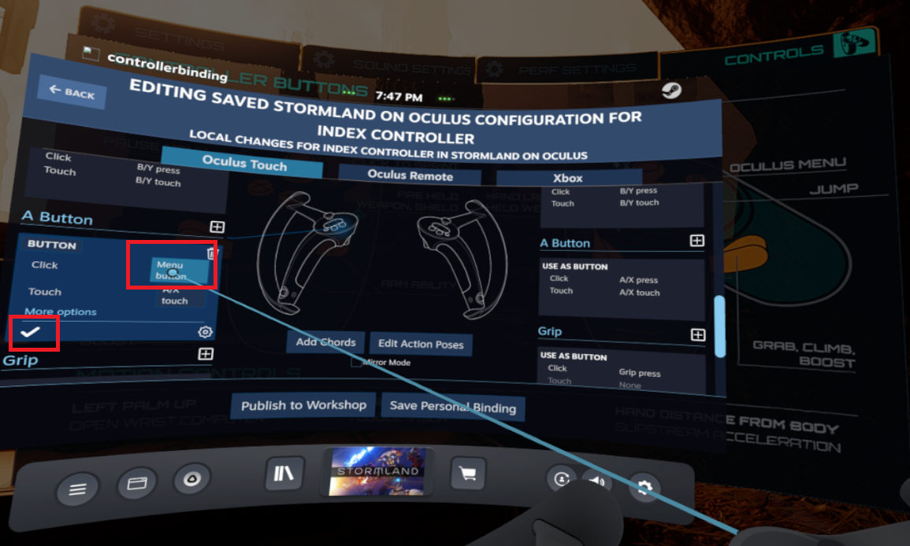

 
Are you an HTC Vive owner looking for new games? Tired of seeing the same old SteamVR titles month after month? Looking for quality entertainment but not sure where to find it? 

Well then you need [Oculus](https://www.oculus.com/experiences/rift/)! Many Oculus games can be [played](https://github.com/LibreVR/Revive/wiki/Compatibility-list) on Vive. [Stormland](https://www.oculus.com/stormland/?locale=en_US) for example is an epic adventure game created by [Insomniac Games](https://insomniac.games), the same folks who brought you [Ratchet and Clank](https://insomniac.games/game/ratchet-and-clank-ps4/)! 

Big names like this are needed in Virtual and Augmented Reality, now known as [XR](https://en.wikipedia.org/wiki/Extended_reality) so let’s take a look at running this Oculus title on a Vive.

#### Does Your Vive needs a Revive?
[Revive](https://github.com/LibreVR/Revive/releases) allows you to play Oculus games on your [HTC Vive](https://www.vive.com/ca/accessory/controller/) as well as other systems. You can use your existing [Vive Wands](https://www.vive.com/ca/accessory/controller/) or any other controllers compatible with [SteamVR](https://store.steampowered.com/app/250820/SteamVR/). The steps below show how to set up [Valve Index Controllers](https://www.valvesoftware.com/en/index/controllers) for use with Vive and the Oculus store. Revive also allows you to play Oculus games on your [HTC Vive Cosmos](https://www.vive.com/eu/product/vive-cosmos/features/), [Valve Index](https://www.valvesoftware.com/en/index/headset), [Windows Mixed Reality](https://www.microsoft.com/en-us/mixed-reality/windows-mixed-reality) systems and more.

Don’t forget to check the [compatibility list](https://github.com/LibreVR/Revive/wiki/Compatibility-list) _before_ making your purchase! Make sure your game works in Revive before you buy it. Currently Stormland is listed as "Working – Stormland fix". It works perfectly out-of-the-box requiring only the controller customizations below. Performance is fine but likely takes a head due to the added overhead of whatever Revive is doing.

As much fun as it is, Revive is not officially supported or endorsed by Oculus so they could block it at any time. This means you are taking the risk that all your Oculus games could disappear at any time or at least your ability to play them... But that is the reality of any jailbreaker, modder, experimenter, enthusiast, hobbiest, etc and what usually gets you closer to the good stuff. Besides, you didn’t buy put together your VR rig just to play phone games on. You want something with a little substance. So for those of us willing to take the risk there’s Revive. 

#### System 
* [Intel 8700 I7](https://ark.intel.com/content/www/us/en/ark/products/126686/intel-core-i7-8700-processor-12m-cache-up-to-4-60-ghz.html)
* 32 GB RAM 
* [Nvidia Geforce 1080ti](https://www.nvidia.com/en-sg/geforce/products/10series/geforce-gtx-1080-ti/)
* [SteamVR](https://store.steampowered.com/app/250820/SteamVR/)
* [Valve Index Controllers](https://www.valvesoftware.com/en/index/controllers)
* HTC Vive Headset 
* [BaseStation ver 1.0](https://www.vive.com/eu/accessory/base-station/)
* 1TB Hard Disk Drive - 7200 RPM SATA

*Half-Life Alyx*

*Stormland on Revive on Oculus*

#### How to Install and Configure Revive for HTC Vive:
1.	Install [Oculus Rift S Software](https://www.oculus.com/setup/) but do not set up the headset.

2.	Follow the installation default options until you get to the screen instructing you to connect your headset. Do not complete this step.

3.	Click the Skip Setup button. 

For our installation we will not be setting up controllers. This is because we're not using Oculus controllers. The hardware setup step is left incomplete indefinitely. Revive must hook into the hardware interface somehow so we leave the setup incomplete at this stage.

Proceed to the next step.

Install the latest version of the ReviveInstaller.exe from github (the one with the highest version number – v2.1.1 as of July 2020)

5.	Launch Oculus and purchase [Stormland](https://www.oculus.com/experiences/rift/1360938750683878/?ranking_trace=117254459210015_1360938750683878_SKYLINEWEB_15sLveFiOUbKwuHmu)

6.	Launch SteamVR and put on the headset.

7.	Open the SteamVR dashboard and note that there is now a new button called Revive. You can click this to bring up the Revive dashboard with all your games. For now just note it’s location. We still need to set up the controllers. You can launch your Oculus titles using the Revive button or from the regular SteamVR menu.

For future refernce, you can launch Stormland from the Revive Dashboard that appears after clicking the Revive button.

You can also launch your Oculus games from the Steam menu like any other game.

### How to Fix the A Buttons and Trackpads for Stormland - Valve Index (Knuckles) Controllers: 

Playing Oculus with Index Knuckles introduces some challenges. Index controllers have very different buttons and sensors than Oculus. 

This means Oculus games need a little attention to get them running beautifuly on the Knuckles. 

Issues related to using Knuckles with Stormland:
* No menu button
* No jump button
* Thumbpad Menu is terrible

So into the Steam Bindings settings we go to fix this.

Launch SteamVR and once it's running press the System button on the Knuckles to bring up the System Menu.

1. Select Settings
2. Click Controllers
3. Click Show Old Binding UI

On the screen entitled _Change Bindings For Stormland on Oculus_ select _Stormland on Oculus_. 

Select a binding. A binding defines which actions are bound to which buttons.

There is an Official Binding for Revive/Index Binding but it doesn't fix the Grip Sensitivity problem so we will choose the Stormland - Index Controllers - Grip Fix Binding instead.

Identify the Stormland - Index Controllers - Grip Fix Bindings section.

Locate "Stormland - Index Controllers - Grip Fix" and click on Activate. This will fix the Grip issue so you only grab your guns when you want to.

C. Once the "Stormland - Index Controllers - Grip Fix" Binding is Activated it becomes your Current Binding. This means you can now edit it in case any buttons need tweaking.

Click Edit on your new Current Binding. This way you can manually assign the left and right A buttons.

Once you’ve clicked the Edit button you’ll see all of the buttons and their assigned actions. We're fixing the Left/Right A buttons and disabling the trackpad menu

Each button can be edited by clicking the little pencil icon that appears when you point at the text in each box. Don't forget to De-Select Mirror Mode so you can assign the right and left controller buttons independently.

After clicking the Edit (pencil icon) for the button you are re-assigning, you can assign the function you want. Don't forget to click the little Check Mark icon to save your changes.

When you click each buttons assignment box it will bring up a list of all possible actions. Pick the one you want from the list.

So now you know what to do. Scroll through the list until you find the Left A and Right A button sections.

Values should be:

* Left A Button Click = Pause Menu

* Left A Button Touch = A/X Touch

* Right A Button Click = Jump

* Right A Button Touch = A/X Touch

Edit the button assignments for both A buttons to select the accompanying function for each.

The Actions you can apply to the button can be seen in the picture below:

The settings should be as follows:

* Left A Button: Click = Menu button

* Right A Button: Click = A/X press

With Index Controllers there's an annoying problem where the menu pops up every time you even slightly touch the Trackpad.

This totally breaks the flow of the game and is very irritating but fortunately can also be fixed.

Scroll up to the Trackpad section and change their definitions the same way you did the A buttons.

The Trackpad sections should look like this:

Values for both Trackpads should be:

* Trackpad Click = None
* Touch = Thumbrest touch

1. Click the check mark to save your change.

2. Click Save Personal Binding to keep your edits.

Click the Back button in the top left corner until you are back in the game. 

Try the buttons, Left A should now open the Pause Menu and Right A should make you jump. Depending on where you are in the game, it may not be possible to jump but you will see an electric field flash around you instead. 

This is fine, the button is working properly and will make you Jump again when you have left the base.

Also your Trackpads will not bring up the menu now, only the Right-A button will. 

That is somewhat similar to the Oculus setup so I use it this way but you can obviously set whatever buttons you prefer to do whatever you want.

There you have it. All set to enjoy some sweet Oculus goodness on your HTC Vive. 

So do it for yourself. Do it for the children. Do it for the Zuck who can clearly see the future and wants you to be a part of it. Just look how happy it makes him when people use his stuff.

#### Potential Issues:

##### Oculus Games Won’t Install

As soon as I bought Stormland I started the download. The download completed but when I clicked the “Install” button nothing happened. 

This is what happens when your Oculus games are saved at the location below:

C:\Program Files\Oculus\Software (or anywhere in the C:\Program Files\Oculus folder)

Although it seems like the right place to save your games, for some reason Oculus doesn’t like it. 

Easy enough to change, simply put the games anywhere else, create a new folder wherever you have space and use this new folder as default location for Oculus games. 

To set a new location for your saved games, follow the steps below:

Launch the Oculus app from the Start menu, taskbar, or desktop.

1.	Click Settings.
2.	Click General.
3.	Click Edit in the Library Locations section.

5.	Click Add Location.

6.	Choose a new library location. You can use any folder you’d like or you can create a new folder by right-clicking the background in the Select Folder window. Once created, you can select the new folder for the new location by double-clicking it and clicking Select Folder.

7.	Double-click your new or chosen folder and click Select Folder.
While you are in the settings, it is a good idea to set the new location as the default From the same menu as above (Settings/General)
1.	Identify the new location
2.	Click the elipses menu button
3.	Select Make Default

Now that your game file location is no longer C:\Program Files\Oculus\Software you will be able to install & play Oculus games. Woohoo! You made it! Give Stormland a try.
Also, in case of further issues there is a Revive wiki
If you’re really stuck or if you love Revive so much you simply must tell the developers and community, there’s a Revive Discord too.

##### How to restart your progress in Stormland

Stormland doesn’t really provide an option for restarting your progress. 

It saves your game locally at whatever point you’ve reached and syncs this with your cloud save. You can’t just restart the game and choose a new save. 

This means multiple players have to share the same progress and isn’t ideal in cases where you have multiple people that want to start their own progress. 

As a workaround you have to delete or move your local saves, go offline, create new ones and then go back online to sync them with the cloud saves. This effectively over-writes your previous progress. **Only do this if you want to lose your progress and start the game over.

Progress and preferences are kept in two files locally which are synchronized with your cloud saves. 

Two files track your progress and preferences. These files can be moved, copied or renamed to reset progress to start a new game.

In case you want to restart the game or have another person start their own progress. 

There really isn’t a proper way to restart Stormland in-game, so that a player can start from the beginning of the game. To get around this, the local save files below can be deleted, renamed or moved. 

Only complete these step is you want to lose your progress and settings in Stormland.

1.	Go offline with the computer Steam is installed on. Disable the Wifi or disconnect Ethernet – make sure you’re offline.
2.	Launch File Explorer and go to C:\Users\your_username\AppData\Local\Oculus\AppData\139725073420658\3257792424300278\cloud\data
3.	Delete, rename or move the two save files in this location:

*	stormland_gamedata_071220.save
*	stormland_userprefs.save 

Your files and folders may have slightly different names, the numbers will be different. You can save these files somewhere on your system if you want to keep the progress stored in them. You can always copy them back into the data folder later.

If you don’t see the appdata folder you can enable it with the steps below:
1.	Launch File Explorer
2.	In the File Explorer click View then Options and then Change Folder and Search Options

 

3.	In the next window that pops up select View and then down below in Advance Settings ensure “Show hidden files, folders and drives” is checked.

4.	Click OK
You will now see the the appdata folder in File Explorer. Go ahead and click through it until you are at the location below:
C:\Users\your_username\AppData\Local\Oculus\AppData\139725073420658\3257792424300278\cloud\data

Again, your folder names (numbers) will likely be different from mine but the general location is the same.

1.	From there you can delete or rename the files contained in the folder. 

Your computer should still be offline at this point. If it's online it will download your cloud saves and restore them to this location. 

To avoid this, launch Stormland while offline and start the game. This means setting up dominant hand, etc and actually starting the level. 

This will create two new save and preference files. 

Once these have been created (you will see them again in C:\Users\your_username\AppData\Local\Oculus\AppData\139725073420658\3257792424300278\cloud\data) you can exit the game and go online again. 

When you next launch the game it will overwrite the cloud saves with the newly created files, effectively wiping out your previous progress and saving the new one. 

Finally, you are all set! Fire up Stormland and experience the goodness of Oculus. It probably takes a performance hit due to Revive overhead but hopefully this isn't needed much longer. [OpenXR](https://www.khronos.org/openxr/) is here and Oculus and Facebook are both members. Other members include Amazon, Apple, Google, Intel, Nvidia, Qualcomm, Samsung, Sony, Valve, Nintendo, Nokia, Panasonic, EA, Epic Games, AMD, Huawei, Acer, Alibaba, Broadcom, Hitachi, HP, HTC, Red Hat, Unity, VMWare and [many](https://www.khronos.org/members/list) more!

Thanks & Enjoy!

Josh

